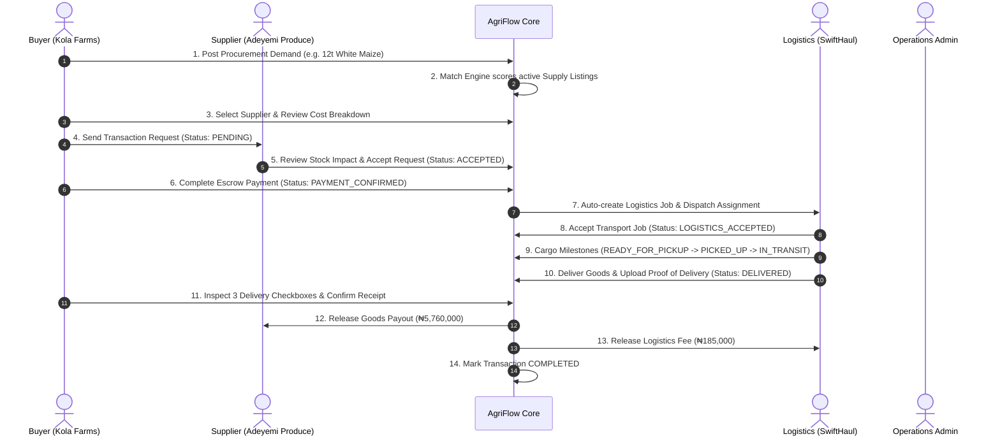

# AgriFlow — Agricultural Trade & Escrow Infrastructure

> **Project Submission**: Team 3A — Build Sync Lab  
> **Platform**: AgriFlow (Web Application & Digital Trade Infrastructure)  
> **Status**: Production Ready & Vercel Optimized  

---

## 🌾 Executive Summary

**AgriFlow** is an integrated B2B digital marketplace and escrow infrastructure designed to solve trust deficits, pricing opacity, and fragmented haulage across agricultural commodity corridors in Nigeria.

The platform provides a unified operating system connecting **Commercial Buyers (Food Processors/Off-takers)**, **Verified Suppliers (Farms & Aggregators)**, **Logistics Carriers**, and **Operations Administrators** with automated matching, locked escrow settlements, and real-time cargo milestone tracking.

---

## 👥 Core Stakeholders & Role Journeys

| Role | Default Sample Account | Primary Functions & Journey |
|---|---|---|
| **Buyer** | `buyer@kolafarms.com` | Posts procurement demands with custom quantities/units (tonnes, bags, kg), evaluates scored supplier matches, reviews itemized cost breakdowns, secures payments via escrow, and inspects delivery proof before releasing funds. |
| **Supplier** | `supplier@adeyemi.com` | Publishes inventory listings across various packagings/grades, receives real-time transaction requests, reviews stock impact, accepts orders, and receives automatic escrow payouts upon delivery. |
| **Logistics Provider** | `logistics@swifthaul.com` | Receives route assignments (e.g. Ogbomoso $\to$ Ikeja), accepts haulage jobs, updates cargo milestones (`READY_FOR_PICKUP` $\to$ `PICKED_UP` $\to$ `IN_TRANSIT` $\to$ `DELIVERED`), uploads delivery proof, and collects logistics fees. |
| **Operations Admin** | `admin@agriflow.ng` | Oversees platform integrity, assigns logistics providers to funded transactions, reviews immutable audit trails, adjudicates disputes, and manages users. |

---

## 🔄 End-to-End Trade Lifecycle & Workflow



---

## ⚙️ Key System Specifications & Features

### 1. Dynamic Unit Selection
Support for authentic agricultural packaging and trade units across both demand creation and supply inventory:
* **Tonnes (MT)**
* **Bags (50kg)**
* **Bags (100kg)**
* **Bags (25kg)**
* **Kilograms (kg)**
* **Crates**
* **Baskets**

### 2. Multi-Factor Matching Algorithm
The matching engine scores supply against demands using weighted parameters:
* **Commodity Type Match** (40% — Mandatory hard filter)
* **Quantity & Batch Availability** (20%)
* **Quality Grade Compatibility** (15% — Grade A/B/C)
* **Required Delivery Timing** (15%)
* **Geographical Feasibility & Trade Corridor** (10%)

### 3. Escrow & Settlement Mechanics
* **Locked Vault**: Funds paid by buyers remain securely locked in the escrow ledger until physical delivery conditions are satisfied.
* **Transparent Breakdown**: Itemized calculation of goods subtotal, logistics fee, and 1% platform fee.
* **3-Point Buyer Inspection**:
  1. Quantity matches order specifications.
  2. Quality grade matches agreed standard.
  3. Packaging and goods undamaged.
* **Dual Release**: Confirming receipt triggers simultaneous payouts to both the commodity supplier and the haulage carrier.

### 4. Resilient LocalStorage Architecture
All data models and state progressions are persisted locally in `localStorage` under the `agriflow_` prefix:
* `agriflow_users`: Registered accounts and credentials
* `agriflow_session`: Current active authentication token
* `agriflow_listings`: Active and fulfilled supply inventory
* `agriflow_demands`: Buyer procurement requirements
* `agriflow_transactions`: Transaction state machine records
* `agriflow_payments`: Escrow ledgers and receipts
* `agriflow_logistics_jobs`: Haulage jobs, route waypoints, and Proof of Delivery
* `agriflow_audit_events`: System-wide audit log

---

## 🎨 Visual Design & Branding

* **Color Palette**: Custom agricultural green theme (`#14532d`, `#15803d`, `#22c55e`, `#f0fdf4`) paired with slate neutrals.
* **Typography**: Inter (Google Fonts) for ultra-crisp, modern readability.
* **Brand Logo**: Precision geometric vector mark featuring dual interlocking leaves forming an escrow flow loop.
* **Design Standard**: High-fidelity conversion matching the Figma design specifications.

---

## 🚀 Deployment Guide (Vercel)

### Option 1: One-Click Git Deployment (Recommended)
1. Push this repository to GitHub, GitLab, or Bitbucket.
2. Log in to [Vercel](https://vercel.com/new).
3. Import the repository.
4. Framework settings will be automatically detected:
   * **Framework Preset**: `Vite`
   * **Build Command**: `npm run build`
   * **Output Directory**: `dist`
5. Click **Deploy**.

> **Note on Routing**: The repository includes [`vercel.json`](./vercel.json) with SPA catch-all rewrites (`/(.*) -> /index.html`), ensuring all subroutes (e.g. `/app/dashboard`, `/app/transactions/:id`, `/app/matches`) work on direct page reloads.

> **Note on the API**: `vercel.json` also proxies `/api/*` to the live Railway backend (`https://agriflow-api-production.up.railway.app/api/*`), ahead of the SPA catch-all. The frontend calls `/api` on its own domain, so no `VITE_API_URL` needs to be set in Vercel and no cross-origin requests are made. Setting `VITE_API_URL` still overrides this.

### Option 2: Deploy via Vercel CLI
```bash
# 1. Install CLI
npm install -g vercel

# 2. Authenticate
vercel login

# 3. Deploy to production
vercel --prod
```

---

## 💻 Local Development Setup

The frontend talks to the Rust backend in `/backend` (see `backend/README.md`)
for auth, listings, demands and transactions — payments, logistics,
disputes, notifications and the audit log still run on localStorage
until those backend slices exist.

```bash
# Clone repository
git clone https://github.com/your-username/agriflow.git
cd agriflow

# Install frontend dependencies
npm install

# Point the frontend at an API (defaults to http://localhost:8080/api)
cp .env.example .env
# — or edit .env to VITE_API_URL=https://agriflow-api-production.up.railway.app/api
# to use the live Railway deployment instead of running the backend locally.

# Start Vite development server
npm run dev

# Run TypeScript compilation & production build
npm run build

# Preview production build locally
npm run preview
```

To run the backend locally instead of pointing at Railway, see
`backend/README.md` (`docker-compose up -d`, `cargo run --bin migrate`,
`cargo run --bin agriflow-api`).

### Seeding demo data

The demo accounts below and a couple of sample listings/demands aren't
seeded automatically anymore (they used to live in localStorage; now
they're real backend accounts). Create them with:

```bash
node scripts/seed-backend.mjs                                             # local backend
API_URL=https://agriflow-api-production.up.railway.app/api node scripts/seed-backend.mjs  # Railway
```

It's idempotent — re-running it logs into existing accounts instead of
failing.

---

## 📋 Default Test Accounts

| Role | Email | Password | Organization |
|---|---|---|---|
| **Buyer** | `buyer@kolafarms.com` | `agriflow123` | Kola Farms Ltd (Off-taker) |
| **Supplier** | `supplier@adeyemi.com` | `agriflow123` | Adeyemi Produce Co. (Farmer Aggregator) |
| **Logistics** | `logistics@swifthaul.com` | `agriflow123` | SwiftHaul Logistics (Haulage Provider) |
| **Admin** | `admin@agriflow.ng` | `agriflow123` | AgriFlow Operations (Internal Admin) |

---

## 🏷️ Team Information & Submission Details

* **Project**: AgriFlow Digital Trade & Escrow Infrastructure
* **Team**: Team 3A — Build Sync Lab
* **Architecture**: React + TypeScript + Vite + TailwindCSS
* **License**: MIT
